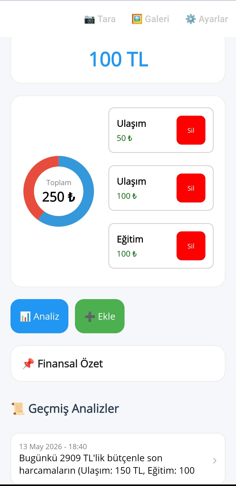

# ÖPT (Öğrenci Para Takibi)
ÖPT, öğrencilerin harcamalarını takip etmelerine yardımcı olan bir uygulamadır. Bu uygulama, öğrencilerin bütçelerini yönetmelerine ve harcamalarını kontrol altında tutmalarına olanak tanır.
Bu proje öğrencilerin finansal durumlarını daha iyi anlamalarına ve harcamalarını daha bilinçli bir şekilde yapmalarına yardımcı olmak amacıyla geliştirilmiştir. ÖPT, kullanıcı dostu arayüzü ve çeşitli özellikleri ile öğrencilerin finansal yönetim becerilerini geliştirmelerine katkıda bulunmayı hedeflemektedir.

## Kullanılan Teknolojiler
.NET MAUI, C#, SQLite, Google Gemini API, MVVM (Model-View-ViewModel) tasarım deseni.

## Öne Çıkan Özellikler
* OCR ile fiş okuma
* Harcamaların kategorilere ayrılması ve haftalık veya aylık gibi grafikte gösterilmesi
* Gemini API ile harcamaların analiz edilmesi 
* Bütçeye göre tasarruf önerileri sunulması 
* Gemini API'si ekleme özelliği 

## Ekran Görüntüleri	
| Ana Ekran | Ana Ekran 2| Ayarlar | Harcama Ekle |
| :---: | :---: | :---: | :---: |
|  |  |  |  >|
----

## Kurulum (Setup)
Projeyi yerel makinenizde çalıştırmak için aşağıdaki adımları izleyebilirsiniz:
1. **Depoyu Klonlayın:**
   ```bash
   git clone [https://github.com/TheDoomer01/OPT-FinansAsistani.git](https://github.com/TheDoomer01/OPT-FinansAsistani.git)
2. Gerekli SDK'ları Kontrol Edin:
    - .NET 8.0 veya üzeri SDK'nın yüklü olduğundan emin olun.
    - Visual Studio 2022 içerisinde ".NET Multi-platform App UI development" iş yükünün yüklü olduğunu doğrulayın.

3. Bağımlılıkları Yükleyin:
    Proje dizinine gidin ve aşağıdaki komutu çalıştırarak gerekli NuGet paketlerini yükleyin:
    ```bash
    dotnet restore

4. ### 🔑 API Anahtarı ve Gizli Bilgilerin Ayarlanması (secrets.json)

Projemiz güvenlik nedeniyle gerçek API anahtarlarını GitHub üzerinde barındırmamaktadır. Projeyi bilgisayarınızda çalıştırabilmek için aşağıdaki adımları izleyerek yerel konfigürasyon dosyanızı oluşturmalısınız:

- **Dosyayı Kopyalayın:**
   Proje ana dizininde bulunan `secrets.example.json` dosyasının bir kopyasını oluşturun ve adını `secrets.json` olarak değiştirin.

   *(Terminal kullanıyorsanız şu komutu girebilirsiniz:)*
   ```bash
   cp secrets.example.json secrets.json

          
- İçeriği Doldurun:
   Yeni oluşturduğunuz secrets.json dosyasını bir metin editörüyle açın ve kendi Google Gemini API anahtarınızı ilgili alana yapıştırın:
   {
  "GeminiApiKey": "BURAYA_KENDI_API_ANAHTARINIZI_YAZIN"
   }
   
- **Visual Studio Ayarı (Çok Önemli):**
   - Visual Studio'da "Solution Explorer" (Çözüm Gezgini) penceresini açın.
   - `secrets.json` dosyasına sağ tıklayıp **"Properties" (Özellikler)** seçeneğine girin.
   - **"Build Action" (Derleme Eylemi)** kısmını **"Embedded resource" (Gömülü Kaynak)** olarak ayarlayın. (Aksi takdirde uygulama dosyayı bulamaz).


5. **Uygulamayı Çalıştırın:**
- Visual Studio üzerinden projenizi açın.
   - Hedef cihaz olarak bir **Android Emulator** veya **Gerçek Android Cihaz** seçin.
   - `F5` tuşuna basarak hata ayıklama modunda başlatın.

6. **API Anahtarı Yapılandırması:**
   - Uygulama içindeki Ayarlar menüsünden Google Gemini API anahtarınızı girerek tüm özellikleri aktif hale getirebilirsiniz.


